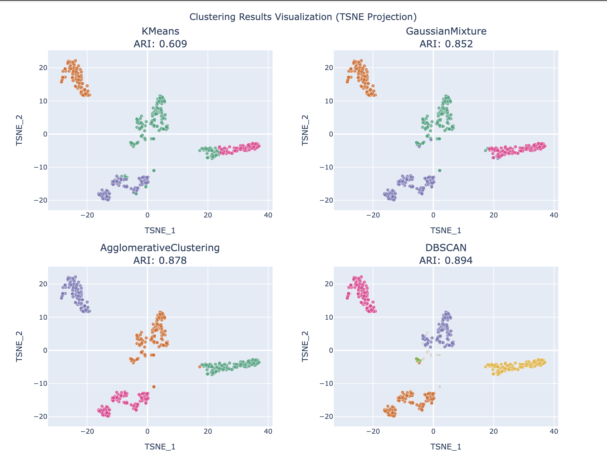

# sound-classifier

Two-part data mining project. Part 1 clusters a personality/behavior dataset with classical tabular methods; part 2 classifies musical instrument sounds, comparing hand-crafted audio features against pretrained PANNs embeddings.

---

---

## Notebooks

| File                      | What it does                                                                                                           |
| ------------------------- | ---------------------------------------------------------------------------------------------------------------------- |
| `part1_tabular.ipynb`     | EDA, imputation, encoding, and clustering of the Extrovert-vs-Introvert dataset (2,900 records × 8 features).          |
| `part1_tabular2.ipynb`    | Same workflow, alternative run.                                                                                        |
| `part2_sound.ipynb`       | Classifies Kaggle's Musical Instruments dataset with two embedding types — classical DSP features vs PANNs (2048-dim). |
| `personality_dataset.csv` | Input for part 1.                                                                                                      |

## Part 1 — Tabular

- Missing-value imputation (median / mode, ~2% missing)
- Encoding + scaling
- Clustering: KMeans, GaussianMixture, AgglomerativeClustering, DBSCAN
- Dimensionality reduction: PCA, t-SNE, UMAP
- Metrics: Silhouette, Davies-Bouldin, Adjusted Rand Index

**Best result:** ARI = 0.72 for the 2-cluster introvert/extrovert split.

## Part 2 — Sound

**Classical embedding:** MFCC + Spectral Contrast + Tonnetz + Zero Crossing Rate + Rolloff (via librosa).
**Deep embedding:** PANNs inference (2048-dim).

Classifiers: KNN, Logistic Regression, XGBoost.

**Best result (classical features):** KNN 93.3%, XGBoost 92.5%. UMAP/t-SNE gave visibly cleaner cluster separation than PCA.

## Dependencies

`pandas`, `numpy`, `scikit-learn`, `xgboost`, `seaborn`, `matplotlib`, `plotly`, `librosa`, `torch`, `panns-inference`
